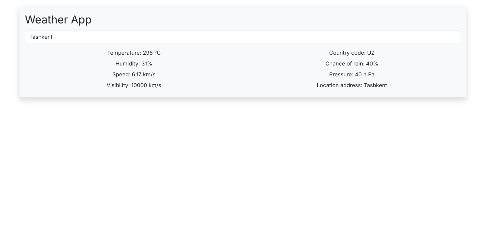
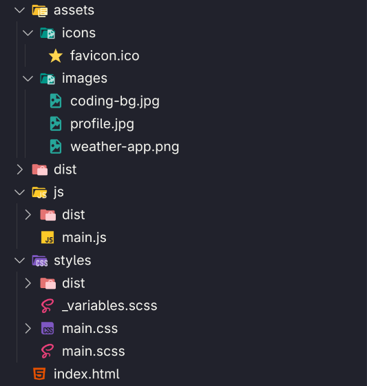

# 💼 My Developer Portfolio

Welcome to my personal portfolio website! This site showcases my skills, projects, and ways to get in touch with me.

Live Site 👉 [https://my-porfolio-mu-five.vercel.app/](https://my-porfolio-mu-five.vercel.app/)

---

## 🚀 Tech Stack

- **HTML5**
- **SCSS (SASS)**
- **Bootstrap 5**
- **JavaScript**
- **Formspree (contact form)**
- ✅ Responsive Design (Mobile Friendly)

---

## 📸 Preview

---

## 🧑‍💻 Sections Included

- **Hero Section** – name, role, intro text, CTA
- **About Me** – short bio and skills
- **Projects** – recent works with GitHub and live links
- **Contact Form** – powered by Formspree
- **Footer** – social media icons and links

---

## 📁 Folder Structure

---

## 📬 Contact

If you'd like to get in touch:

- ✉️ Email: [suhrobxakker@gmail.com](mailto:suhrobxakker@gmail.com)
- 💻 GitHub: [github.com/suhrob008](https://github.com/suhrob008)

---

## 📄 License

This project is licensed for personal and educational use. Feel free to fork and customize your own version. ⭐
